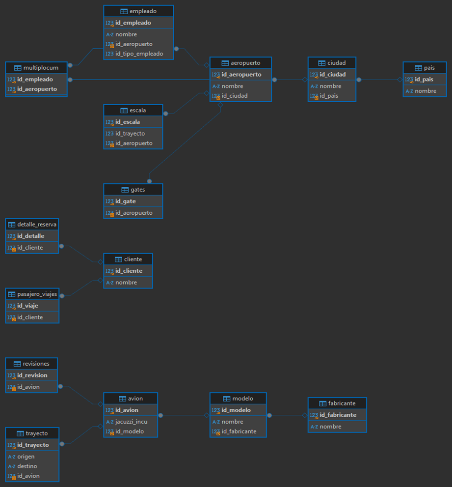
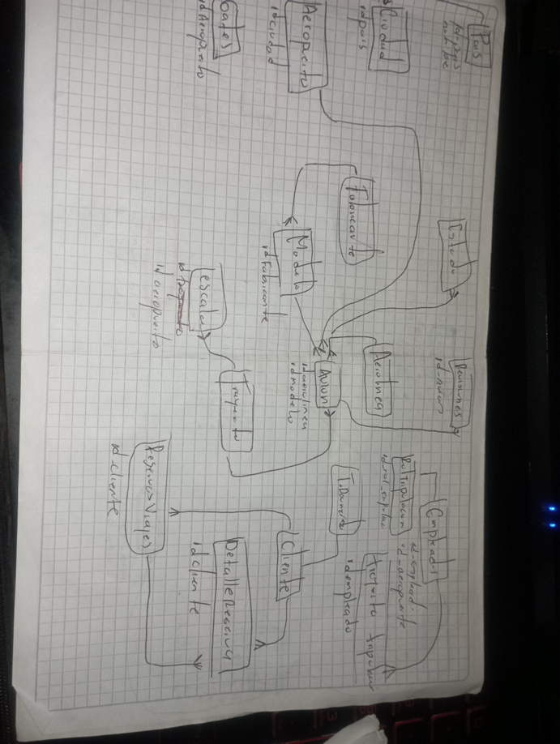

ENTIDADES
1. Aeropuerto
id_aeropuerto
nombre
id_ciudad
2. Avión
id_avion
jacuzzi_incu
id_modelo
3. Ciudad
id_ciudad
nombre
id_pais
4. Cliente
id_cliente
nombre
5. Detalle Reserva
id_detalle
id_cliente
6. Empleado
id_empleado
nombre
id_aeropuerto
id_tipo_empleado
7. Escala
id_escala
id_trayecto
id_aeropuerto
8. Fabricante
id_fabricante
nombre
9. Gates
id_gate
id_aeropuerto
10. Modelo
id_modelo
nombre
id_fabricante
11. Multiplum
id_empleado
id_aeropuerto
12. País
id_pais
nombre
13. Pasajeros Viajes
id_viaje
id_cliente
14. Revisiones
id_revision
id_avion
15. Trayecto
id_trayecto
origen
destino
id_avion

RELACIONES

Aeropuerto

Relación con Ciudad: Cada aeropuerto pertenece a una ciudad (1 a 1).
Avión

Relación con Modelo: Cada avión tiene un modelo (1 a 1).
Ciudad

Relación con País: Cada ciudad pertenece a un país (1 a 1).
Cliente

Relación con Detalle Reserva: Un cliente puede tener múltiples detalles de reserva (1 a N).
Relación con Pasajeros Viajes: Un cliente puede estar asociado a múltiples viajes (1 a N).
Detalle Reserva

Relación con Cliente: Cada detalle de reserva pertenece a un cliente (N a 1).
Empleado

Relación con Aeropuerto: Un empleado trabaja en un aeropuerto (N a 1).
Relación con Multiplum: Un empleado puede estar asociado a múltiples aeropuertos (1 a N).
Escala

Relación con Aeropuerto: Una escala está asociada a un aeropuerto (N a 1).
Relación con Trayecto: Una escala pertenece a un trayecto (N a 1).
Fabricante

Relación con Modelo: Un fabricante puede producir múltiples modelos de avión (1 a N).
Gates

Relación con Aeropuerto: Cada gate pertenece a un aeropuerto (N a 1).
Modelo

Relación con Fabricante: Cada modelo es fabricado por un fabricante (N a 1).
Multiplum

Relación con Empleado: Cada entrada en multiplum está asociada a un empleado (N a 1).
Relación con Aeropuerto: Cada entrada en multiplum está asociada a un aeropuerto (N a 1).
Pasajeros Viajes

Relación con Cliente: Cada viaje tiene un cliente asociado (N a 1).
Revisiones

Relación con Avión: Cada revisión está asociada a un avión (N a 1).
Trayecto

Relación con Avión: Cada trayecto es realizado por un avión (N a 1).
Relación con Escala: Un trayecto puede tener múltiples escalas (1 a N).

MODELO FISICO

Aeropuerto
CREATE TABLE `aeropuerto` (
  `id_aeropuerto` int NOT NULL AUTO_INCREMENT,
  `nombre` varchar(100) NOT NULL,
  `id_ciudad` int DEFAULT NULL,
  PRIMARY KEY (`id_aeropuerto`),
  KEY `id_ciudad` (`id_ciudad`),
  CONSTRAINT `aeropuerto_ibfk_1` FOREIGN KEY (`id_ciudad`) REFERENCES `ciudad` (`id_ciudad`)
)

avion
CREATE TABLE `avion` (
  `id_avion` int NOT NULL AUTO_INCREMENT,
  `jacuzzi_incu` varchar(100) DEFAULT NULL,
  `id_modelo` int DEFAULT NULL,
  PRIMARY KEY (`id_avion`),
  KEY `id_modelo` (`id_modelo`),
  CONSTRAINT `avion_ibfk_1` FOREIGN KEY (`id_modelo`) REFERENCES `modelo` (`id_modelo`)
)

Ciudad
CREATE TABLE `ciudad` (
  `id_ciudad` int NOT NULL AUTO_INCREMENT,
  `nombre` varchar(100) NOT NULL,
  `id_pais` int DEFAULT NULL,
  PRIMARY KEY (`id_ciudad`),
  KEY `id_pais` (`id_pais`),
  CONSTRAINT `ciudad_ibfk_1` FOREIGN KEY (`id_pais`) REFERENCES `pais` (`id_pais`)
) 

Cliente
CREATE TABLE `cliente` (
  `id_cliente` int NOT NULL AUTO_INCREMENT,
  `nombre` varchar(100) NOT NULL,
  PRIMARY KEY (`id_cliente`)
)

Detalle reserva

CREATE TABLE `detalle_reserva` (
  `id_detalle` int NOT NULL AUTO_INCREMENT,
  `id_cliente` int DEFAULT NULL,
  PRIMARY KEY (`id_detalle`),
  KEY `id_cliente` (`id_cliente`),
  CONSTRAINT `detalle_reserva_ibfk_1` FOREIGN KEY (`id_cliente`) REFERENCES `cliente` (`id_cliente`)
)

Empleado

CREATE TABLE `empleado` (
  `id_empleado` int NOT NULL AUTO_INCREMENT,
  `nombre` varchar(100) NOT NULL,
  `id_aeropuerto` int DEFAULT NULL,
  `id_tipo_empleado` int DEFAULT NULL,
  PRIMARY KEY (`id_empleado`),
  KEY `id_aeropuerto` (`id_aeropuerto`),
  CONSTRAINT `empleado_ibfk_1` FOREIGN KEY (`id_aeropuerto`) REFERENCES `aeropuerto` (`id_aeropuerto`)
)

Escala 
CREATE TABLE `escala` (
  `id_escala` int NOT NULL AUTO_INCREMENT,
  `id_trayecto` int DEFAULT NULL,
  `id_aeropuerto` int DEFAULT NULL,
  PRIMARY KEY (`id_escala`),
  KEY `id_aeropuerto` (`id_aeropuerto`),
  CONSTRAINT `escala_ibfk_1` FOREIGN KEY (`id_aeropuerto`) REFERENCES `aeropuerto` (`id_aeropuerto`)
)

Fabricante
CREATE TABLE `fabricante` (
  `id_fabricante` int NOT NULL AUTO_INCREMENT,
  `nombre` varchar(100) NOT NULL,
  PRIMARY KEY (`id_fabricante`)
)

Gates 
CREATE TABLE `gates` (
  `id_gate` int NOT NULL AUTO_INCREMENT,
  `id_aeropuerto` int DEFAULT NULL,
  PRIMARY KEY (`id_gate`),
  KEY `id_aeropuerto` (`id_aeropuerto`),
  CONSTRAINT `gates_ibfk_1` FOREIGN KEY (`id_aeropuerto`) REFERENCES `aeropuerto` (`id_aeropuerto`)
)

Modelo 
CREATE TABLE `modelo` (
  `id_modelo` int NOT NULL AUTO_INCREMENT,
  `nombre` varchar(100) NOT NULL,
  `id_fabricante` int DEFAULT NULL,
  PRIMARY KEY (`id_modelo`),
  KEY `id_fabricante` (`id_fabricante`),
  CONSTRAINT `modelo_ibfk_1` FOREIGN KEY (`id_fabricante`) REFERENCES `fabricante` (`id_fabricante`)
)

Multiplum
CREATE TABLE `multiplocum` (
  `id_empleado` int NOT NULL,
  `id_aeropuerto` int NOT NULL,
  PRIMARY KEY (`id_empleado`,`id_aeropuerto`),
  KEY `id_aeropuerto` (`id_aeropuerto`),
  CONSTRAINT `multiplocum_ibfk_1` FOREIGN KEY (`id_empleado`) REFERENCES `empleado` (`id_empleado`),
  CONSTRAINT `multiplocum_ibfk_2` FOREIGN KEY (`id_aeropuerto`) REFERENCES `aeropuerto` (`id_aeropuerto`)
)
País
CREATE TABLE `pais` (
  `id_pais` int NOT NULL AUTO_INCREMENT,
  `nombre` varchar(100) NOT NULL,
  PRIMARY KEY (`id_pais`)
) 

Pasajeros viajes 
CREATE TABLE `pasajero_viajes` (
  `id_viaje` int NOT NULL AUTO_INCREMENT,
  `id_cliente` int DEFAULT NULL,
  PRIMARY KEY (`id_viaje`),
  KEY `id_cliente` (`id_cliente`),
  CONSTRAINT `pasajero_viajes_ibfk_1` FOREIGN KEY (`id_cliente`) REFERENCES `cliente` (`id_cliente`)
)

Revisiones 
CREATE TABLE `revisiones` (
  `id_revision` int NOT NULL AUTO_INCREMENT,
 `id_avion` int DEFAULT NULL,
  PRIMARY KEY (`id_revision`),
  KEY `id_avion` (`id_avion`),
  CONSTRAINT `revisiones_ibfk_1` FOREIGN KEY (`id_avion`) REFERENCES `avion` (`id_avion`)
)

Trayecto 

CREATE TABLE `trayecto` (
  `id_trayecto` int NOT NULL AUTO_INCREMENT,
  `origen` varchar(100) DEFAULT NULL,
  `destino` varchar(100) DEFAULT NULL,
  `id_avion` int DEFAULT NULL,
  PRIMARY KEY (`id_trayecto`),
  KEY `id_avion` (`id_avion`),
  CONSTRAINT `trayecto_ibfk_1` FOREIGN KEY (`id_avion`) REFERENCES `avion` (`id_avion`)
)

